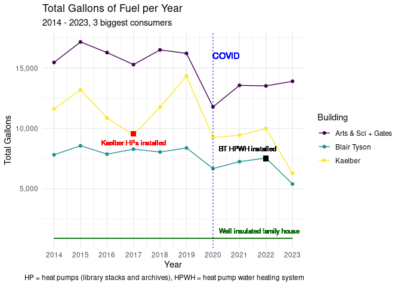
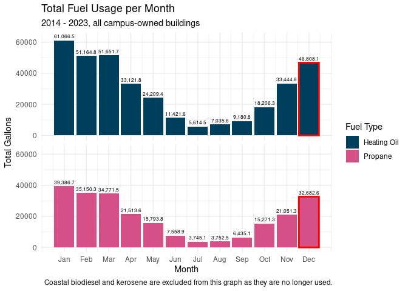
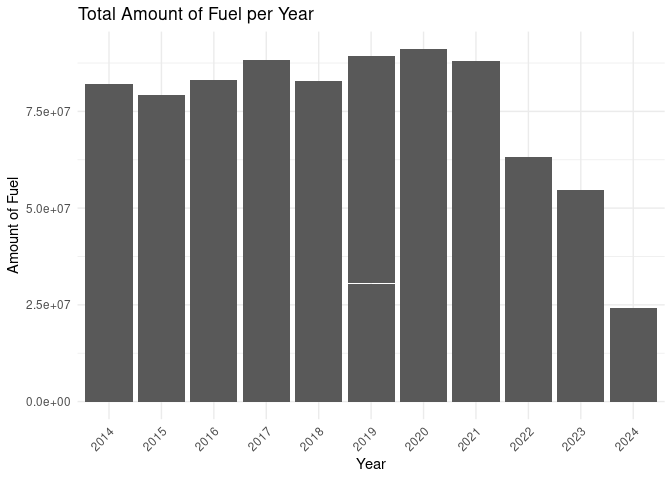
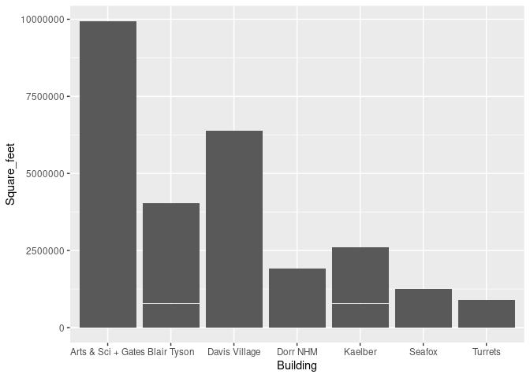
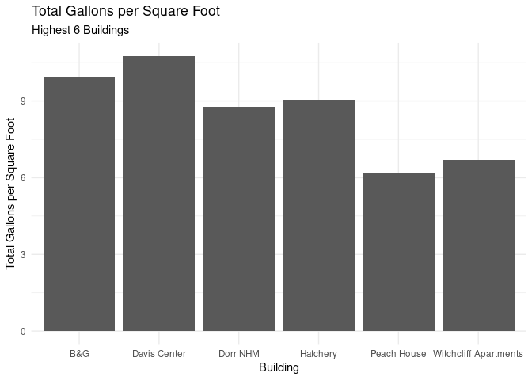
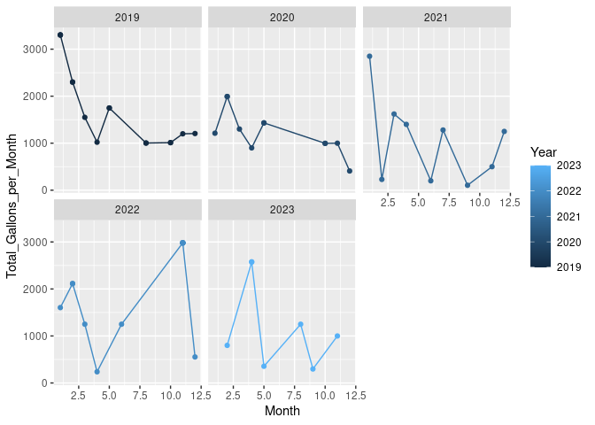
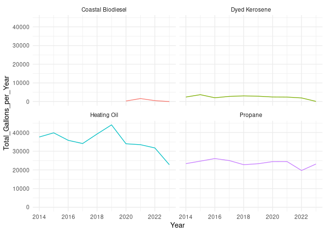
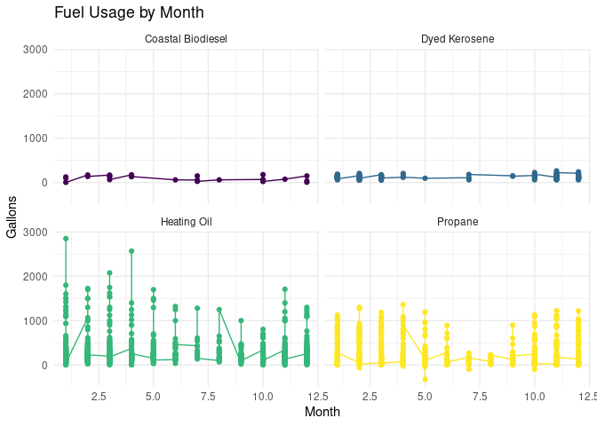
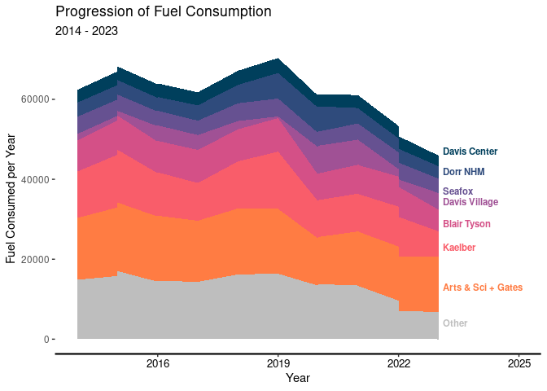

Project memo
================
Team name

This document should contain a detailed account of the data clean up for
your data and the design choices you are making for your plots. For
instance you will want to document choices you’ve made that were
intentional for your graphic, e.g. color you’ve chosen for the plot.
Think of this document as a code script someone can follow to reproduce
the data cleaning steps and graphics in your handout.

``` r
library(tidyverse)
library(broom)
library(readr)
library(lubridate)
library(stringr)
library(dplyr)
library(readxl)
library(ggstream)
library(showtext)
library(ggtext)
library(gghighlight)
options(scipen = 999)
```

## Data Clean Up Steps for Overall Data

### Step 1: Load datasets

#### Step 1a: Load fossil fuel data and change column names

``` r
fuels <- read_csv("../data/Dead-River.csv",
                  col_names = c("X1", "X2", 
                                "Delivery_date", "Fuel_type",
                                "Tank_number", "Building",
                                "Gallons", "Unit_cost",
                                "Cost"))
```

#### Step 1b: Load building area data

``` r
area <- read_csv("../data/BuildingArea.csv",
                 col_names = c("Building", "Square_feet"))
```

    ## Rows: 23 Columns: 2
    ## ── Column specification ────────────────────────────────────────────────────────
    ## Delimiter: ","
    ## chr (2): Building, Square_feet
    ## 
    ## ℹ Use `spec()` to retrieve the full column specification for this data.
    ## ℹ Specify the column types or set `show_col_types = FALSE` to quiet this message.

#### Step 1c: Join area data to fuels data

``` r
fuels <- fuels |>
left_join(area)
```

    ## Joining with `by = join_by(Building)`

### Step 2: Change Delivery Date & Remove top extra row

``` r
fuels <- fuels |>
select(Delivery_date, Fuel_type, Tank_number, Building, Gallons, Unit_cost, Cost, Square_feet) |>
  filter(Delivery_date != "Delivery Date") |> 
  mutate(Delivery_date = mdy(Delivery_date))
```

### Step 3: Change tank number to integer values

``` r
fuels <- fuels |>  
  mutate(Tank_number = case_when(
   Tank_number == "Tank 8" ~ "8",
   Tank_number == "Tank 3" ~ "3",
   Tank_number == "Tank 24" ~ "24",
   Tank_number == "Tank 17" ~ "17",
   TRUE ~ Tank_number
  ),
  Tank_number = as.integer(Tank_number))
```

### Step 4: Change cost to numeric values

``` r
fuels <- fuels |>
  mutate(Cost = case_when(
    Cost == "610.12 cr" ~ "-610.12", # the cr denotes a credit/refund, so here it is changed to a negative numeric value
    TRUE ~ Cost
  ),
  Cost = as.numeric(Cost))
```

    ## Warning: There was 1 warning in `mutate()`.
    ## ℹ In argument: `Cost = as.numeric(Cost)`.
    ## Caused by warning:
    ## ! NAs introduced by coercion

### Step 5: Standardize fuel type names

``` r
fuels <- fuels |>  
  mutate(Fuel_type = case_when(
    Fuel_type == "#2 HEATING OIL" ~ "Heating Oil",
    Fuel_type == "#2 Heating Oil" ~ "Heating Oil",
    Fuel_type == "SLPP #2 FUEL OIL" ~ "Heating Oil",
    Fuel_type == "SLP LIQ PROPANE" ~ "Propane",
    Fuel_type == "LIQUID PROPANE" ~ "Propane",
    Fuel_type == "DYED KEROSENE" ~ "Dyed Kerosene",
  TRUE ~ Fuel_type
  ))
```

### Step 6: Change gallons and unit cost to numeric values

``` r
fuels <- fuels |>
  mutate(Gallons = as.numeric(Gallons)) |>
  mutate(Unit_cost = as.numeric(Unit_cost))
```

### Step 7: Add year and month variables

``` r
fuels <- fuels |>
  mutate(Year = substr(Delivery_date, 1, 4)) |>
  mutate(Month = substr(Delivery_date, 6, 7)) |>
  mutate(Year = as.numeric(Year)) |>
  mutate(Month = as.numeric(Month))
```

### Step 8: Change square feet to numeric

``` r
fuels <- fuels |>
  mutate(Square_feet = case_when(
    Building == "Turrets" ~ "8400",
    Building == "Turrets Annex" ~ "4200",
    TRUE ~ Square_feet
  )) |>
  mutate(Square_feet = as.numeric(Square_feet))
```

## Actual Plots

### ggsave example for saving plots

``` r
p1 <- starwars |>
  filter(mass < 1000, 
         species %in% c("Human", "Cerean", "Pau'an", "Droid", "Gungan")) |>
  ggplot() +
  geom_point(aes(x = mass, 
                 y = height, 
                 color = species)) +
  labs(x = "Weight (kg)", 
       y = "Height (m)",
       color = "Species",
       title = "Weight and Height of Select Starwars Species",
       caption = paste("This data comes from the starwars api: https://swapi.py43.com"))


ggsave("example-starwars.png", width = 4, height = 4)

ggsave("example-starwars-wide.png", width = 6, height = 4)
```

### Plot 1: Fuel Prices Over Time

#### Final Plot 1

``` r
fuels %>% 
  ggplot(mapping = aes(x = Delivery_date, y = Unit_cost, color = Fuel_type)) +
  geom_line() +
  facet_wrap(~ Fuel_type) +
  scale_color_viridis_d() +
  theme_minimal() +
  guides(color = FALSE) +
  labs(title = "Fuel Prices Over Time",
       subtitle = "2014 - 2024",
       x = "Delivery date",
       y = "Cost per gallon in USD")
```

    ## Warning: The `<scale>` argument of `guides()` cannot be `FALSE`. Use "none" instead as
    ## of ggplot2 3.3.4.
    ## This warning is displayed once every 8 hours.
    ## Call `lifecycle::last_lifecycle_warnings()` to see where this warning was
    ## generated.

<!-- -->

### Plot 2: Total Amount of Fuel per Building

``` r
fuels |>
  group_by(Building, Fuel_type) |>
  summarize(Total_Gallons_per_Building = sum(Gallons), .groups = "drop") |>
  slice_max(order_by = Total_Gallons_per_Building, n = 5) |>
  slice_max(Total_Gallons_per_Building, n = 5) |>
  ggplot(aes(y = fct_reorder(Building, Total_Gallons_per_Building), x = Total_Gallons_per_Building, fill = Fuel_type)) +
  geom_col() +
  theme_minimal() +
  scale_fill_viridis_d() +
  guides(color = FALSE) +
  labs(title = "Buildings Using the Most Amount of Fuel",
       subtitle = "2014 - 2024",
       y = "Building",
       x = "Total Amount of Fuel in Gallons",
       fill = "Fuel Type")
```


``` r
ggsave("Buildings-Using-Most-Fuel.png")
```

    ## Saving 7 x 5 in image

### Plot 3: 3 biggest consumers over time

``` r
fuels |>
  filter(Building %in% c("Blair Tyson", "Arts & Sci + Gates", "Kaelber"), Year < 2024) |>
  group_by(Building, Year) |>
  summarize(year_sum = sum(Gallons), .groups = "drop") |>
  ggplot(aes(x = Year, y = year_sum, color = Building, group = Building)) +
  geom_point() +
  geom_line() +
  theme_minimal() +
  labs(title = "Total Gallons of Fuel per Year",
       subtitle = "2014 - 2023, 3 biggest consumers",
       y = "Total Gallons",
       caption = "HP = heat pumps (library stacks and archives), HPWH = heat pump water heating system") +
  scale_x_continuous(breaks = seq(from = 2014, to = 2024, by = 1)) +
  ylim(0, NA) +
  scale_y_continuous(labels = scales::comma) +
  scale_color_viridis_d() +
  geom_vline(xintercept = 2020, linetype = "dotted", colour = "blue") +
  geom_text(aes(x = 2020.5, y = 16000), label = "COVID", colour = "blue") +
  geom_text(aes(x = 2021.3, y = 8300), label = "BT HPWH installed", colour = "black", size = 3) +
  geom_point(aes(x = 2022, y = 7500), color = "black", size = 3, shape = 15) +
  geom_text(aes(x = 2017, y = 8800), color = "red", label = "Kaelber HPs installed", size = 3) +
  geom_point(aes(x = 2017, y = 9550), color = "red", size = 3, shape = 15) +
  geom_line(aes(y = 900), color = "darkgreen") +
  geom_text(aes(x = 2021.75, y = 1500), label = "Well insulated family house", color = "darkgreen", size = 3)
```

    ## Scale for y is already present.
    ## Adding another scale for y, which will replace the existing scale.

<!-- -->

``` r
ggsave("3-biggest-consumers.png", width = 8, height = 4)
```

### Plot 4: Total fuel usage by month

``` r
fuels |> 
  filter(Year < 2024, Fuel_type %in% c("Heating Oil", "Propane")) |>
  group_by(Month, Fuel_type) |>
  summarize(month_sum = sum(Gallons), .groups = "drop") |>
  ggplot(aes(x = Month, y = month_sum, fill = Fuel_type)) +
  geom_col() +
  geom_col(data = . %>% filter(Month == 12), color = "red", size = 1, show.legend = FALSE) +
  scale_y_continuous(labels = scales::comma) +
  ylim(0, 63000) +
  scale_x_continuous(breaks = 1:12, labels = month.abb) +
 facet_wrap(~ Fuel_type, ncol = 1) +    geom_text(aes(x = Month, y = month_sum, label = scales::comma(month_sum)), 
            vjust = -0.5, 
            size = 2.2) +
  labs(title = "Total Fuel Usage per Month",
       subtitle = "2014 - 2023, all campus-owned buildings",
       y = "Total Gallons",
       fill = "Fuel Type",
       caption = "Coastal biodiesel and kerosene are excluded from this graph as they are no longer used.") +
  theme_minimal() +
  theme(strip.text = element_blank()) +
  scale_fill_viridis_d()
```

    ## Warning: Using `size` aesthetic for lines was deprecated in ggplot2 3.4.0.
    ## ℹ Please use `linewidth` instead.
    ## This warning is displayed once every 8 hours.
    ## Call `lifecycle::last_lifecycle_warnings()` to see where this warning was
    ## generated.

    ## Scale for y is already present.
    ## Adding another scale for y, which will replace the existing scale.

<!-- -->

``` r
ggsave("fuel_usage_per_month.png", width = 8, height = 4)
```

# Plot Graveyard

### Plot ?: A bunch that I’ll rename and clean up later

``` r
fuels |>
  group_by(Fuel_type) |>
  mutate(Total_Gallons_per_Fuel_Type = sum(Gallons)) |>
ggplot(aes(x = Fuel_type, y = Total_Gallons_per_Fuel_Type)) +
  geom_col() +
  scale_x_discrete(guide = guide_axis(angle = 45)) +
  theme_minimal() +
  guides(color = FALSE) +
  labs(title = "Total Amount of Fuel per Fuel Type",
       x = "Fuel Type",
       y = "Amount of Fuel")
```

<!-- -->

``` r
fuels |>
  group_by(Fuel_type) |>
  mutate(Total_Gallons_per_Fuel_Type = sum(Gallons)) |>
  filter(Year != 2024) |>
  ggplot(aes(x = Year, y = Total_Gallons_per_Fuel_Type)) +
  geom_col() +
  scale_x_discrete(guide = guide_axis(angle = 45)) +
  theme_minimal() +
  guides(color = FALSE) +
  labs(title = "Total Amount of Fuel per Year",
       x = "Year",
       y = "Amount of Fuel")
```

<!-- -->

``` r
fuels |>
  filter(Year != 2024) |>
  group_by(Year, Building) |>
  mutate(Total_Gallons_per_years = sum(Gallons)) %>%
  ggplot(aes(x = Year, y = Total_Gallons_per_years, fill = Fuel_type))+
  geom_col() +
  facet_wrap(~Building) +
  theme_minimal()
```

<!-- -->

``` r
fuels |>
  filter(Building == "Kaelber" & Year != 2024) |>
  group_by(Year) |>
  #View() |>
  mutate(Total_Gallons_per_Year = sum(Gallons)) |>
  ggplot(aes(x = Year, y = Total_Gallons_per_Year)) +
  geom_col()
```

<!-- -->

``` r
# make one big function


# main_total_fuels |>
#   filter(Building == c("Witchcliff Apartments", "Witchcliff","Studio 5+6","PRF",
#                        "Pottery Studio","Peggy Barn", "Peach House", "Hatchery", "Greenhouse", 
#                        "Davis Carriage", "Cottage", "CHE Generator", "Carriage", 
#                        "BHF New Greenhouse", "BHF Main Bldg/2 Greenhouse", "BHF Farm House", 
#                        "18B Norris Ave", "171 Beech Hill Road", "14 Norris Ave")) |>
#   (Other_Gallons <- sum(Total_Gallons))

 # main_total_fuels <- data.frame(
 #  Building = unique(fuels$Building),
 #  Total_Gallons = unique(fuels$Total_Gallons_per_Building)
 # )

 # with(main_total_fuels, sum(Total_Gallons[Total_Gallons < 9952.2]))

#  main_total_fuels <- main_total_fuels |>
#    add_row(Building = "Other",
#           Total_Gallons = with(main_total_fuels, sum(Total_Gallons[Total_Gallons < 41871.1])))
# 
# main_total_fuels <- main_total_fuels |>
#   filter(Total_Gallons >= 41871.1 | Building == "Other")
 #main_total_fuels <- data.frame(
#  Building = unique(fuels$Building),
#  Total_Gallons = unique(fuels$Total_Gallons_per_Building)
# )

 # with(main_total_fuels, sum(Total_Gallons[Total_Gallons < 9952.2]))

# main_total_fuels <- main_total_fuels |>
#   add_row(Building = "Other",
#          Total_Gallons = with(main_total_fuels, sum(Total_Gallons[Total_Gallons # < 41871.1])))

#main_total_fuels <- main_total_fuels |>
#  filter(Total_Gallons >= 41871.1 | Building == "Other")
```

``` r
# do factor shift thingy

#  ggplot(main_total_fuels, aes(x = "", y = Total_Gallons, fill = Building)) +
#   geom_bar(stat = "identity", width = 1, color = "white") +
#   coord_polar("y", start = 0) +
#   theme_void()
# 
# ggplot(main_total_fuels, aes(y = Building, x = Total_Gallons)) +
#   geom_col()
# ggplot(main_total_fuels, aes(x = "", y = Total_Gallons, fill = Building)) +
#  geom_bar(stat = "identity", width = 1, color = "white") +
#  coord_polar("y", start = 0) +
#  theme_void()

#ggplot(main_total_fuels, aes(y = Building, x = Total_Gallons)) +
#  geom_col()
```

### Plot ?: Building area

``` r
fuels |>
  filter(Square_feet >= 5000) |>
  ggplot(aes(x = Building, y = Square_feet)) +
  geom_col()
```

<!-- -->

### Plot ?: Gallons per square foot

``` r
fuels |>
  filter(Year >= 2019, Year <= 2023) |>
  group_by(Building) |>
  mutate(Total_Gallons_per_Building = sum(Gallons)) |>
  mutate(total_per_sf = (Total_Gallons_per_Building / Square_feet)) |>
  summarize(total_per_sf = unique(total_per_sf)) |>
  filter(total_per_sf > 2) |>
  ggplot(aes(x = Building, y = total_per_sf)) +
  geom_col() +
  labs(title = "Total Gallons per Square Foot",
       subtitle = "Highest 6 Buildings",
       y = "Total Gallons per Square Foot") +
  theme_minimal() +
  coord_flip()
```

<!-- -->

### Plot showing gallons per month before and after heat pump - Not useful in the end

``` r
fuels |>
  filter(Building == "Kaelber" & Year >= 2019 & Year <= 2023) |>
  group_by(Year, Month) |>
  mutate(Total_Gallons_per_Month = sum(Gallons)) |>
  #View() |>
  group_by(Year) |>
  ggplot(aes(x = Month, y = Total_Gallons_per_Month, group = Year, colour = Year)) +
  geom_line() +
  geom_point() +
  facet_wrap(~Year)
```

<!-- -->

``` r
fuels|>
  filter(Year != 2024) |>
  group_by(Year, Fuel_type) |>
  mutate(Total_Gallons_per_Year = sum(Gallons)) |>
  ggplot(aes(x = Year, y = Total_Gallons_per_Year, colour = Fuel_type)) +
  geom_line() +
  facet_wrap(~Fuel_type) +
  theme_minimal() +
  theme(legend.position = "none")
```

<!-- -->

### Plot ?: Fuel usage per month

``` r
fuels %>% 
  ggplot(mapping = aes(x = Month, y = Gallons, color = Fuel_type, group = Fuel_type)) +
  facet_wrap(~ Fuel_type) +
  geom_point() +
  geom_line() +
  scale_color_viridis_d() +
  theme_minimal() +
  guides(color = FALSE) +
  labs(title = "Fuel Usage by Month",
       x = "Month",
       y = "Gallons")
```

<!-- -->

``` r
### Plot ?:
```

``` r
# Colour Palette
pal=c("#003f5c",
      "#2f4b7c",
      "#665191",
      "#a05195",
      "#d45087",
      "#f95d6a",
      "#ff7c43",
      #"#ffa600",
      "grey",
      "grey",
      "grey",
      "grey",
      "grey",
      "grey",
      "grey",
      "grey",
      "grey",
      "grey",
      "grey",
      "grey",
      "grey",
      "grey",
      "grey",
      "grey",
      "grey",
      "grey",
      "grey",
      "grey",
      "grey",
      "grey")

# Order of buildings for the fill
order <- c( "Davis Center", "Davis Village", "Dorr NHM", "Seafox", "Blair Tyson", "Kaelber", "Arts & Sci + Gates", "Studio 5+6", "Pottery Studio", "Peach House", "Hatchery", "Greenhouse", "Carriage", "BHF New Greenhouse", "BHF Main Bldg/2 Greenhouses", "BHF Farm House", "18B Norris Ave", "171 Beech Hill Road", "14 Norris Ave", "Turrets", "Turrets Annex", "B&G")


fuels |>
  filter(#Building %in% c("Blair Tyson", "Arts & Sci + Gates", "Kaelber", "Seafox", "Dorr NHM"), 
         Year != 2024) |>
  group_by(Year, Building) |>
  mutate(Total_Gallons_per_years = sum(Gallons)) |>
  mutate(Building = factor(Building, levels=order)) |>
  filter(!is.na(Building)) |> #why do we need this?
  ggplot(aes(Year, Total_Gallons_per_years, fill = Building)) +
  geom_area() +
  
  scale_fill_manual(values = pal) +
  scale_color_manual(values = pal) +
  # gghighlight(Building %in% 
  #               c("Blair Tyson", "Arts & Sci + Gates", "Kaelber", "Seafox", "Dorr NHM", 
  #                 "Davis Village", "Davis Center"),
  #             unhighlighted_params = list(fill = "grey"))
  
  theme(
    axis.line.x = element_line(linewidth = .75),
    panel.grid = element_blank(),
    axis.text.y = element_blank(),
    axis.text.x = element_text(color="black", size=10),
    plot.margin = margin(10,50,10,10),
    panel.background = element_rect(fill = "white", colour = "white", 
                                   linetype = "solid", linewidth = 0.5),
    legend.position = "none",
  ) +
  labs(title = "Progression of the Top Five Fuel Consumers",
       subtitle = "2014 - 2023",
       y = "",
       x = "Year") +
  
# Labels
  annotate("text", x = 2023.1, y = 32000,
           label = "Seafox",
           hjust=0,
           size=3,
           lineheight=.8,
           fontface="bold",
           color=pal[1]) +
  
  annotate("text", x = 2023.1, y = 27500,
           label = "Dorr NHM",
           hjust=0,
           size=3,
           lineheight=.8,
           fontface="bold",
           color=pal[2]) +
  
  annotate("text", x = 2023.1, y = 23000,
           label = "Blair Tyson",
           hjust=0,
           size=3,
           lineheight=.8,
           fontface="bold",
           color=pal[3]) +
  
  annotate("text", x = 2023.1, y = 18000,
           label = "Kaelber",
           hjust=0,
           size=3,
           lineheight=.8,
           fontface="bold",
           color=pal[4]) +
  
  annotate("text", x = 2023.1, y = 10000,
           label = "Arts & Sci + Gates",
           hjust=0,
           size=3,
           lineheight=.8,
           fontface="bold",
           color=pal[5]) +
  
  annotate("text", x = 2025, y = 27500,
           label = "",
           hjust=0,
           size=3,
           lineheight=.8,
           fontface="bold",
           color=pal[2])
```

<!-- -->

``` r
ggsave("top-5-fuel-area-plot.png", width = 4, height = 4)
```

``` r
library(gghighlight)  # Make sure this is loaded

fuels |> 
  filter(Year > 2022) |>
  group_by(Building) |>
  summarize(Total_Gallons_per_Buildings = sum(Gallons)) |>
  mutate(Building = factor(Building, levels=order)) |>
  ggplot(aes(x = Total_Gallons_per_Buildings, 
             y = fct_reorder(Building, Total_Gallons_per_Buildings, .fun = sum), 
             fill = Building)) +
  geom_col() +
  # gghighlight(Building %in% 
  #               c("Davis Center", "Davis Village", "Blair Tyson", "Arts & Sci + Gates", "Seafox", "Dorr NHM", "Kaelber")) +
  
  scale_fill_manual(values = pal) +

  theme(
    axis.line.x = element_line(linewidth = .75),
    panel.grid = element_blank(),
    axis.text.x = element_text(color="black", size=10),
    panel.background = element_rect(fill = "white", colour = "white", 
                                    linetype = "solid", linewidth = 0.5),
    legend.position = "none"
  ) +
  labs(title = "Use of Fuel Across COA Buildings",
       subtitle = "2022 - 2024",
       y = "",
       x = "Total Amount of Fuel in Gallons")
```

<!-- -->

``` r
ggsave("top-5-fuel-bar-plot.png", width = 4, height = 4)
```
