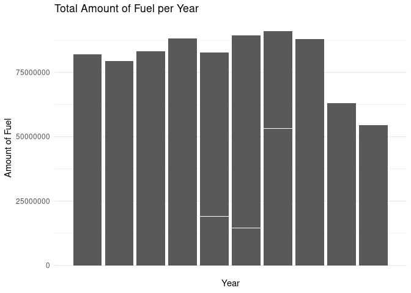
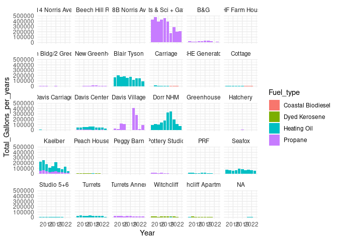
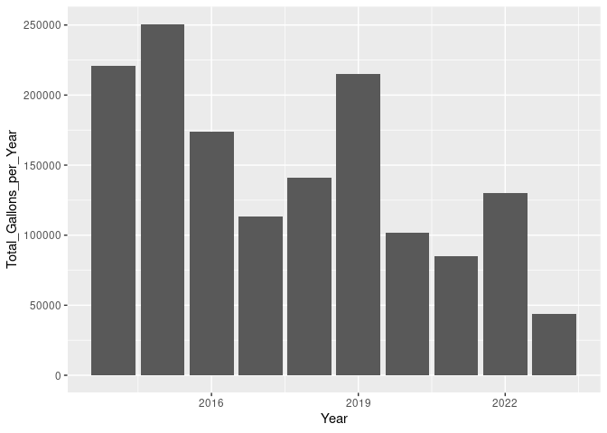

Project memo
================
Team name

This document should contain a detailed account of the data clean up for
your data and the design choices you are making for your plots. For
instance you will want to document choices you’ve made that were
intentional for your graphic, e.g. color you’ve chosen for the plot.
Think of this document as a code script someone can follow to reproduce
the data cleaning steps and graphics in your handout.

``` r
library(tidyverse)
library(broom)
library(readr)
library(lubridate)
library(stringr)
```

## Data Clean Up Steps for Overall Data

### Step 1: Load datasets

#### Step 1a: Load fossil fuel data and change column names

``` r
fuels <- read_csv("../data/Dead-River.csv",
                  col_names = c("X1", "X2", 
                                "Delivery_date", "Fuel_type",
                                "Tank_number", "Building",
                                "Gallons", "Unit_cost",
                                "Cost"))
```

#### Step 1b: Load building area data

``` r
area <- read_csv("../data/BuildingArea.csv")
```

    ## Rows: 22 Columns: 2
    ## ── Column specification ────────────────────────────────────────────────────────
    ## Delimiter: ","
    ## chr (1): Building
    ## num (1): Square feet
    ## 
    ## ℹ Use `spec()` to retrieve the full column specification for this data.
    ## ℹ Specify the column types or set `show_col_types = FALSE` to quiet this message.

#### Step 1c: Join area data to fuels data

``` r
fuels <- fuels |>
left_join(area)
```

    ## Joining with `by = join_by(Building)`

### Step 2: Change Delivery Date

``` r
fuels <- fuels |>
select(Delivery_date, Fuel_type, Tank_number, Building, Gallons, Unit_cost, Cost) |>
  filter(Delivery_date != "Delivery Date") |> 
  mutate(Delivery_date = mdy(Delivery_date))
```

### Step 3: Change tank number to integer values

``` r
fuels <- fuels |>  
  mutate(Tank_number = case_when(
   Tank_number == "Tank 8" ~ "8",
   Tank_number == "Tank 3" ~ "3",
   Tank_number == "Tank 24" ~ "24",
   Tank_number == "Tank 17" ~ "17",
   TRUE ~ Tank_number
  ),
  Tank_number = as.integer(Tank_number))
```

### Step 4: Change cost to numeric values

``` r
fuels <- fuels |>
  mutate(Cost = case_when(
    Cost == "610.12 cr" ~ "-610.12", # the cr denotes a credit/refund, so here it is changed to a negative numeric value
    TRUE ~ Cost
  ),
  Cost = as.numeric(Cost))
```

    ## Warning: There was 1 warning in `mutate()`.
    ## ℹ In argument: `Cost = as.numeric(Cost)`.
    ## Caused by warning:
    ## ! NAs introduced by coercion

### Step 5: Standardize fuel type names

``` r
fuels <- fuels |>  
  mutate(Fuel_type = case_when(
    Fuel_type == "#2 HEATING OIL" ~ "Heating Oil",
    Fuel_type == "#2 Heating Oil" ~ "Heating Oil",
    Fuel_type == "SLPP #2 FUEL OIL" ~ "Heating Oil",
    Fuel_type == "SLP LIQ PROPANE" ~ "Propane",
    Fuel_type == "LIQUID PROPANE" ~ "Propane",
    Fuel_type == "DYED KEROSENE" ~ "Dyed Kerosene",
  TRUE ~ Fuel_type
  ))
```

### Step 6: Change gallons and unit cost to numeric values

``` r
fuels <- fuels |>
  mutate(Gallons = as.numeric(Gallons)) |>
  mutate(Unit_cost = as.numeric(Unit_cost))
```

### Step 7: Add total gallons per building variable

``` r
fuels <- fuels |>
  group_by(Building) |>
  mutate(Total_Gallons_per_Building = sum(Gallons))
```

### Step 8: Add year and month variables

``` r
fuels <- fuels |>
  mutate(Year = substr(Delivery_date, 1, 4)) |>
  mutate(Month = substr(Delivery_date, 6, 7))
```

### Step 9: Add total gallons per fuel type variable

``` r
fuels <- fuels |>
  group_by(Fuel_type) |>
  mutate(Total_Gallons_per_Fuel_Type = sum(Gallons))
```

### Step 10: Add total gallons per year variable

``` r
fuels <- fuels |>
  group_by(Year) |>
  mutate(Total_Gallons_per_year = sum(Gallons))
```

### Step ?: Ignore for now I’m working on it but am confused

``` r
# make one big function

main_total_fuels <- data.frame(
  Building = unique(fuels$Building),
  Total_Gallons = unique(fuels$Total_Gallons_per_Building)
)

# main_total_fuels |>
#   filter(Building == c("Witchcliff Apartments", "Witchcliff","Studio 5+6","PRF",
#                        "Pottery Studio","Peggy Barn", "Peach House", "Hatchery", "Greenhouse", 
#                        "Davis Carriage", "Cottage", "CHE Generator", "Carriage", 
#                        "BHF New Greenhouse", "BHF Main Bldg/2 Greenhouse", "BHF Farm House", 
#                        "18B Norris Ave", "171 Beech Hill Road", "14 Norris Ave")) |>
#   (Other_Gallons <- sum(Total_Gallons))

 with(main_total_fuels, sum(Total_Gallons[Total_Gallons < 9952.2]))
```

    ## [1] 60046.9

``` r
main_total_fuels <- main_total_fuels |>
  add_row(Building = "Other", 
          Total_Gallons = with(main_total_fuels, sum(Total_Gallons[Total_Gallons < 9952.2])))

main_total_fuels <- main_total_fuels |>
  filter(Total_Gallons >= 9952.2 | Building == "Other")
```

## Plots

### ggsave example for saving plots

``` r
p1 <- starwars |>
  filter(mass < 1000, 
         species %in% c("Human", "Cerean", "Pau'an", "Droid", "Gungan")) |>
  ggplot() +
  geom_point(aes(x = mass, 
                 y = height, 
                 color = species)) +
  labs(x = "Weight (kg)", 
       y = "Height (m)",
       color = "Species",
       title = "Weight and Height of Select Starwars Species",
       caption = paste("This data comes from the starwars api: https://swapi.py43.com"))


ggsave("example-starwars.png", width = 4, height = 4)

ggsave("example-starwars-wide.png", width = 6, height = 4)
```

### Plot 1: Fuel Prices Over Time

#### Final Plot 1

``` r
fuels %>% 
  ggplot(mapping = aes(x = Delivery_date, y = Unit_cost, color = Fuel_type)) +
  geom_line() +
  facet_wrap(~ Fuel_type) +
  scale_color_viridis_d() +
  theme_minimal() +
  guides(color = FALSE) +
  labs(title = "Fuel Prices Over Time",
       subtitle = "2014 - 2024",
       x = "Delivery date",
       y = "Cost per gallon in USD")
```

    ## Warning: The `<scale>` argument of `guides()` cannot be `FALSE`. Use "none" instead as
    ## of ggplot2 3.3.4.
    ## This warning is displayed once every 8 hours.
    ## Call `lifecycle::last_lifecycle_warnings()` to see where this warning was
    ## generated.

<!-- -->

### Plot 2: Total Amount of Fuel per Building

``` r
ggplot(fuels, aes(y = Building, x = Total_Gallons_per_Building)) +
  geom_col() +
  #scale_x_discrete(guide = guide_axis(angle = 45)) +
  theme_minimal() +
  guides(color = FALSE) +
  labs(title = "Total Amount of Fuel per Building",
       x = "Building",
       y = "Amount of Fuel")
```

<!-- -->

### Plot 3: A bunch that I’ll rename and clean up later

``` r
ggplot(fuels, aes(x = Fuel_type, y = Total_Gallons_per_Fuel_Type)) +
  geom_col() +
  scale_x_discrete(guide = guide_axis(angle = 45)) +
  theme_minimal() +
  guides(color = FALSE) +
  labs(title = "Total Amount of Fuel per Fuel Type",
       x = "Fuel Type",
       y = "Amount of Fuel")
```

<!-- -->

``` r
ggplot(fuels, aes(x = Year, y = Total_Gallons_per_Fuel_Type)) +
  geom_col() +
  scale_x_discrete(guide = guide_axis(angle = 45)) +
  theme_minimal() +
  guides(color = FALSE) +
  labs(title = "Total Amount of Fuel per Year",
       x = "Year",
       y = "Amount of Fuel")
```

<!-- -->

``` r
fuels |>
  filter(Year != 2024) |>
  group_by(Year) |>
  mutate(Total_Gallons_per_year = sum(Gallons)) %>% 
  ggplot(aes(x = Year, y = Total_Gallons_per_year, fill = Fuel_type))+
  geom_col() +
  facet_wrap(~Building)
```

<!-- -->

``` r
  theme_minimal()
```

    ## List of 136
    ##  $ line                            :List of 6
    ##   ..$ colour       : chr "black"
    ##   ..$ linewidth    : num 0.5
    ##   ..$ linetype     : num 1
    ##   ..$ lineend      : chr "butt"
    ##   ..$ arrow        : logi FALSE
    ##   ..$ inherit.blank: logi TRUE
    ##   ..- attr(*, "class")= chr [1:2] "element_line" "element"
    ##  $ rect                            :List of 5
    ##   ..$ fill         : chr "white"
    ##   ..$ colour       : chr "black"
    ##   ..$ linewidth    : num 0.5
    ##   ..$ linetype     : num 1
    ##   ..$ inherit.blank: logi TRUE
    ##   ..- attr(*, "class")= chr [1:2] "element_rect" "element"
    ##  $ text                            :List of 11
    ##   ..$ family       : chr ""
    ##   ..$ face         : chr "plain"
    ##   ..$ colour       : chr "black"
    ##   ..$ size         : num 11
    ##   ..$ hjust        : num 0.5
    ##   ..$ vjust        : num 0.5
    ##   ..$ angle        : num 0
    ##   ..$ lineheight   : num 0.9
    ##   ..$ margin       : 'margin' num [1:4] 0points 0points 0points 0points
    ##   .. ..- attr(*, "unit")= int 8
    ##   ..$ debug        : logi FALSE
    ##   ..$ inherit.blank: logi TRUE
    ##   ..- attr(*, "class")= chr [1:2] "element_text" "element"
    ##  $ title                           : NULL
    ##  $ aspect.ratio                    : NULL
    ##  $ axis.title                      : NULL
    ##  $ axis.title.x                    :List of 11
    ##   ..$ family       : NULL
    ##   ..$ face         : NULL
    ##   ..$ colour       : NULL
    ##   ..$ size         : NULL
    ##   ..$ hjust        : NULL
    ##   ..$ vjust        : num 1
    ##   ..$ angle        : NULL
    ##   ..$ lineheight   : NULL
    ##   ..$ margin       : 'margin' num [1:4] 2.75points 0points 0points 0points
    ##   .. ..- attr(*, "unit")= int 8
    ##   ..$ debug        : NULL
    ##   ..$ inherit.blank: logi TRUE
    ##   ..- attr(*, "class")= chr [1:2] "element_text" "element"
    ##  $ axis.title.x.top                :List of 11
    ##   ..$ family       : NULL
    ##   ..$ face         : NULL
    ##   ..$ colour       : NULL
    ##   ..$ size         : NULL
    ##   ..$ hjust        : NULL
    ##   ..$ vjust        : num 0
    ##   ..$ angle        : NULL
    ##   ..$ lineheight   : NULL
    ##   ..$ margin       : 'margin' num [1:4] 0points 0points 2.75points 0points
    ##   .. ..- attr(*, "unit")= int 8
    ##   ..$ debug        : NULL
    ##   ..$ inherit.blank: logi TRUE
    ##   ..- attr(*, "class")= chr [1:2] "element_text" "element"
    ##  $ axis.title.x.bottom             : NULL
    ##  $ axis.title.y                    :List of 11
    ##   ..$ family       : NULL
    ##   ..$ face         : NULL
    ##   ..$ colour       : NULL
    ##   ..$ size         : NULL
    ##   ..$ hjust        : NULL
    ##   ..$ vjust        : num 1
    ##   ..$ angle        : num 90
    ##   ..$ lineheight   : NULL
    ##   ..$ margin       : 'margin' num [1:4] 0points 2.75points 0points 0points
    ##   .. ..- attr(*, "unit")= int 8
    ##   ..$ debug        : NULL
    ##   ..$ inherit.blank: logi TRUE
    ##   ..- attr(*, "class")= chr [1:2] "element_text" "element"
    ##  $ axis.title.y.left               : NULL
    ##  $ axis.title.y.right              :List of 11
    ##   ..$ family       : NULL
    ##   ..$ face         : NULL
    ##   ..$ colour       : NULL
    ##   ..$ size         : NULL
    ##   ..$ hjust        : NULL
    ##   ..$ vjust        : num 1
    ##   ..$ angle        : num -90
    ##   ..$ lineheight   : NULL
    ##   ..$ margin       : 'margin' num [1:4] 0points 0points 0points 2.75points
    ##   .. ..- attr(*, "unit")= int 8
    ##   ..$ debug        : NULL
    ##   ..$ inherit.blank: logi TRUE
    ##   ..- attr(*, "class")= chr [1:2] "element_text" "element"
    ##  $ axis.text                       :List of 11
    ##   ..$ family       : NULL
    ##   ..$ face         : NULL
    ##   ..$ colour       : chr "grey30"
    ##   ..$ size         : 'rel' num 0.8
    ##   ..$ hjust        : NULL
    ##   ..$ vjust        : NULL
    ##   ..$ angle        : NULL
    ##   ..$ lineheight   : NULL
    ##   ..$ margin       : NULL
    ##   ..$ debug        : NULL
    ##   ..$ inherit.blank: logi TRUE
    ##   ..- attr(*, "class")= chr [1:2] "element_text" "element"
    ##  $ axis.text.x                     :List of 11
    ##   ..$ family       : NULL
    ##   ..$ face         : NULL
    ##   ..$ colour       : NULL
    ##   ..$ size         : NULL
    ##   ..$ hjust        : NULL
    ##   ..$ vjust        : num 1
    ##   ..$ angle        : NULL
    ##   ..$ lineheight   : NULL
    ##   ..$ margin       : 'margin' num [1:4] 2.2points 0points 0points 0points
    ##   .. ..- attr(*, "unit")= int 8
    ##   ..$ debug        : NULL
    ##   ..$ inherit.blank: logi TRUE
    ##   ..- attr(*, "class")= chr [1:2] "element_text" "element"
    ##  $ axis.text.x.top                 :List of 11
    ##   ..$ family       : NULL
    ##   ..$ face         : NULL
    ##   ..$ colour       : NULL
    ##   ..$ size         : NULL
    ##   ..$ hjust        : NULL
    ##   ..$ vjust        : num 0
    ##   ..$ angle        : NULL
    ##   ..$ lineheight   : NULL
    ##   ..$ margin       : 'margin' num [1:4] 0points 0points 2.2points 0points
    ##   .. ..- attr(*, "unit")= int 8
    ##   ..$ debug        : NULL
    ##   ..$ inherit.blank: logi TRUE
    ##   ..- attr(*, "class")= chr [1:2] "element_text" "element"
    ##  $ axis.text.x.bottom              : NULL
    ##  $ axis.text.y                     :List of 11
    ##   ..$ family       : NULL
    ##   ..$ face         : NULL
    ##   ..$ colour       : NULL
    ##   ..$ size         : NULL
    ##   ..$ hjust        : num 1
    ##   ..$ vjust        : NULL
    ##   ..$ angle        : NULL
    ##   ..$ lineheight   : NULL
    ##   ..$ margin       : 'margin' num [1:4] 0points 2.2points 0points 0points
    ##   .. ..- attr(*, "unit")= int 8
    ##   ..$ debug        : NULL
    ##   ..$ inherit.blank: logi TRUE
    ##   ..- attr(*, "class")= chr [1:2] "element_text" "element"
    ##  $ axis.text.y.left                : NULL
    ##  $ axis.text.y.right               :List of 11
    ##   ..$ family       : NULL
    ##   ..$ face         : NULL
    ##   ..$ colour       : NULL
    ##   ..$ size         : NULL
    ##   ..$ hjust        : num 0
    ##   ..$ vjust        : NULL
    ##   ..$ angle        : NULL
    ##   ..$ lineheight   : NULL
    ##   ..$ margin       : 'margin' num [1:4] 0points 0points 0points 2.2points
    ##   .. ..- attr(*, "unit")= int 8
    ##   ..$ debug        : NULL
    ##   ..$ inherit.blank: logi TRUE
    ##   ..- attr(*, "class")= chr [1:2] "element_text" "element"
    ##  $ axis.text.theta                 : NULL
    ##  $ axis.text.r                     :List of 11
    ##   ..$ family       : NULL
    ##   ..$ face         : NULL
    ##   ..$ colour       : NULL
    ##   ..$ size         : NULL
    ##   ..$ hjust        : num 0.5
    ##   ..$ vjust        : NULL
    ##   ..$ angle        : NULL
    ##   ..$ lineheight   : NULL
    ##   ..$ margin       : 'margin' num [1:4] 0points 2.2points 0points 2.2points
    ##   .. ..- attr(*, "unit")= int 8
    ##   ..$ debug        : NULL
    ##   ..$ inherit.blank: logi TRUE
    ##   ..- attr(*, "class")= chr [1:2] "element_text" "element"
    ##  $ axis.ticks                      : list()
    ##   ..- attr(*, "class")= chr [1:2] "element_blank" "element"
    ##  $ axis.ticks.x                    : NULL
    ##  $ axis.ticks.x.top                : NULL
    ##  $ axis.ticks.x.bottom             : NULL
    ##  $ axis.ticks.y                    : NULL
    ##  $ axis.ticks.y.left               : NULL
    ##  $ axis.ticks.y.right              : NULL
    ##  $ axis.ticks.theta                : NULL
    ##  $ axis.ticks.r                    : NULL
    ##  $ axis.minor.ticks.x.top          : NULL
    ##  $ axis.minor.ticks.x.bottom       : NULL
    ##  $ axis.minor.ticks.y.left         : NULL
    ##  $ axis.minor.ticks.y.right        : NULL
    ##  $ axis.minor.ticks.theta          : NULL
    ##  $ axis.minor.ticks.r              : NULL
    ##  $ axis.ticks.length               : 'simpleUnit' num 2.75points
    ##   ..- attr(*, "unit")= int 8
    ##  $ axis.ticks.length.x             : NULL
    ##  $ axis.ticks.length.x.top         : NULL
    ##  $ axis.ticks.length.x.bottom      : NULL
    ##  $ axis.ticks.length.y             : NULL
    ##  $ axis.ticks.length.y.left        : NULL
    ##  $ axis.ticks.length.y.right       : NULL
    ##  $ axis.ticks.length.theta         : NULL
    ##  $ axis.ticks.length.r             : NULL
    ##  $ axis.minor.ticks.length         : 'rel' num 0.75
    ##  $ axis.minor.ticks.length.x       : NULL
    ##  $ axis.minor.ticks.length.x.top   : NULL
    ##  $ axis.minor.ticks.length.x.bottom: NULL
    ##  $ axis.minor.ticks.length.y       : NULL
    ##  $ axis.minor.ticks.length.y.left  : NULL
    ##  $ axis.minor.ticks.length.y.right : NULL
    ##  $ axis.minor.ticks.length.theta   : NULL
    ##  $ axis.minor.ticks.length.r       : NULL
    ##  $ axis.line                       : list()
    ##   ..- attr(*, "class")= chr [1:2] "element_blank" "element"
    ##  $ axis.line.x                     : NULL
    ##  $ axis.line.x.top                 : NULL
    ##  $ axis.line.x.bottom              : NULL
    ##  $ axis.line.y                     : NULL
    ##  $ axis.line.y.left                : NULL
    ##  $ axis.line.y.right               : NULL
    ##  $ axis.line.theta                 : NULL
    ##  $ axis.line.r                     : NULL
    ##  $ legend.background               : list()
    ##   ..- attr(*, "class")= chr [1:2] "element_blank" "element"
    ##  $ legend.margin                   : 'margin' num [1:4] 5.5points 5.5points 5.5points 5.5points
    ##   ..- attr(*, "unit")= int 8
    ##  $ legend.spacing                  : 'simpleUnit' num 11points
    ##   ..- attr(*, "unit")= int 8
    ##  $ legend.spacing.x                : NULL
    ##  $ legend.spacing.y                : NULL
    ##  $ legend.key                      : list()
    ##   ..- attr(*, "class")= chr [1:2] "element_blank" "element"
    ##  $ legend.key.size                 : 'simpleUnit' num 1.2lines
    ##   ..- attr(*, "unit")= int 3
    ##  $ legend.key.height               : NULL
    ##  $ legend.key.width                : NULL
    ##  $ legend.key.spacing              : 'simpleUnit' num 5.5points
    ##   ..- attr(*, "unit")= int 8
    ##  $ legend.key.spacing.x            : NULL
    ##  $ legend.key.spacing.y            : NULL
    ##  $ legend.frame                    : NULL
    ##  $ legend.ticks                    : NULL
    ##  $ legend.ticks.length             : 'rel' num 0.2
    ##  $ legend.axis.line                : NULL
    ##  $ legend.text                     :List of 11
    ##   ..$ family       : NULL
    ##   ..$ face         : NULL
    ##   ..$ colour       : NULL
    ##   ..$ size         : 'rel' num 0.8
    ##   ..$ hjust        : NULL
    ##   ..$ vjust        : NULL
    ##   ..$ angle        : NULL
    ##   ..$ lineheight   : NULL
    ##   ..$ margin       : NULL
    ##   ..$ debug        : NULL
    ##   ..$ inherit.blank: logi TRUE
    ##   ..- attr(*, "class")= chr [1:2] "element_text" "element"
    ##  $ legend.text.position            : NULL
    ##  $ legend.title                    :List of 11
    ##   ..$ family       : NULL
    ##   ..$ face         : NULL
    ##   ..$ colour       : NULL
    ##   ..$ size         : NULL
    ##   ..$ hjust        : num 0
    ##   ..$ vjust        : NULL
    ##   ..$ angle        : NULL
    ##   ..$ lineheight   : NULL
    ##   ..$ margin       : NULL
    ##   ..$ debug        : NULL
    ##   ..$ inherit.blank: logi TRUE
    ##   ..- attr(*, "class")= chr [1:2] "element_text" "element"
    ##  $ legend.title.position           : NULL
    ##  $ legend.position                 : chr "right"
    ##  $ legend.position.inside          : NULL
    ##  $ legend.direction                : NULL
    ##  $ legend.byrow                    : NULL
    ##  $ legend.justification            : chr "center"
    ##  $ legend.justification.top        : NULL
    ##  $ legend.justification.bottom     : NULL
    ##  $ legend.justification.left       : NULL
    ##  $ legend.justification.right      : NULL
    ##  $ legend.justification.inside     : NULL
    ##  $ legend.location                 : NULL
    ##  $ legend.box                      : NULL
    ##  $ legend.box.just                 : NULL
    ##  $ legend.box.margin               : 'margin' num [1:4] 0cm 0cm 0cm 0cm
    ##   ..- attr(*, "unit")= int 1
    ##  $ legend.box.background           : list()
    ##   ..- attr(*, "class")= chr [1:2] "element_blank" "element"
    ##  $ legend.box.spacing              : 'simpleUnit' num 11points
    ##   ..- attr(*, "unit")= int 8
    ##   [list output truncated]
    ##  - attr(*, "class")= chr [1:2] "theme" "gg"
    ##  - attr(*, "complete")= logi TRUE
    ##  - attr(*, "validate")= logi TRUE

``` r
fuels |>
  filter(Building == "Kaelber" & Year != 2024) |>
  group_by(Year) |>
  #View() |>
  mutate(Total_Gallons_per_Year = sum(Gallons)) |>
  ggplot(aes(x = Year, y = Total_Gallons_per_Year)) +
  geom_col()
```

<!-- -->

``` r
# do factor shift thingy

ggplot(main_total_fuels, aes(x = "", y = Total_Gallons, fill = Building)) +
  geom_bar(stat = "identity", width = 1, color = "white") +
  coord_polar("y", start = 0) +
  theme_void()
```

<!-- -->
