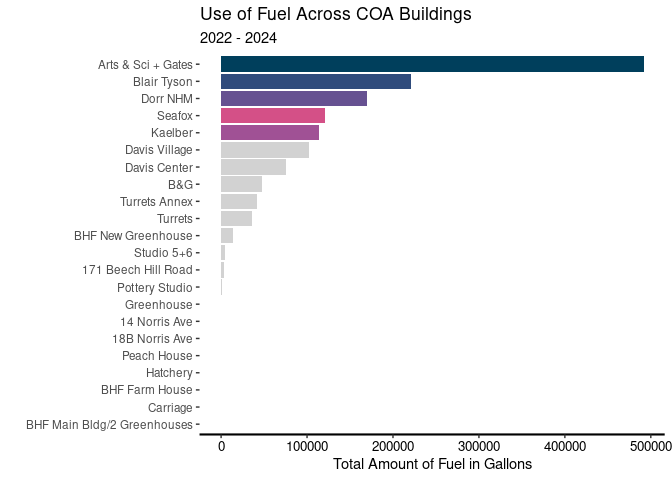

Project memo
================
Team name

This document should contain a detailed account of the data clean up for
your data and the design choices you are making for your plots. For
instance you will want to document choices you’ve made that were
intentional for your graphic, e.g. color you’ve chosen for the plot.
Think of this document as a code script someone can follow to reproduce
the data cleaning steps and graphics in your handout.

``` r
library(tidyverse)
library(broom)
library(readr)
library(lubridate)
library(stringr)
```

## Data Clean Up Steps for Overall Data

### Step 1: \_\_\_\_\_\_\_\_\_

``` r
fuels <- read_csv("../data/Dead-River.csv",
                  col_names = c("X1", "X2", 
                                "Delivery_date", "Fuel_type",
                                "Tank_number", "Building",
                                "Gallons", "Unit_cost",
                                "Cost")) |>
  select(Delivery_date, Fuel_type, Tank_number, Building, Gallons, Unit_cost, Cost) |>
  filter(Delivery_date != "Delivery Date") |> 
  mutate(Delivery_date = mdy(Delivery_date)) |>
  mutate(Tank_number = case_when(
  Tank_number == "Tank 8" ~ "8",
  Tank_number == "Tank 3" ~ "3",
  Tank_number == "Tank 24" ~ "24",
  Tank_number == "Tank 17" ~ "17",
  TRUE ~ Tank_number
),
Tank_number = as.integer(Tank_number)) %>% 
mutate(Cost = case_when(
    Cost == "610.12 cr" ~ "-610.12",
    TRUE ~ Cost
  ),
  Cost = as.numeric(Cost)) %>% 
  mutate(Gallons = as.numeric(Gallons)) %>% 
  mutate(Unit_cost = as.numeric(Unit_cost)) %>% 
  mutate(Fuel_type = case_when(
    Fuel_type == "#2 HEATING OIL" ~ "Heating Oil",
    Fuel_type == "#2 Heating Oil" ~ "Heating Oil",
    Fuel_type == "SLPP #2 FUEL OIL" ~ "Heating Oil",
    Fuel_type == "SLP LIQ PROPANE" ~ "Propane",
    Fuel_type == "LIQUID PROPANE" ~ "Propane",
    Fuel_type == "DYED KEROSENE" ~ "Dyed Kerosene",
  TRUE ~ Fuel_type
  ))
```

### Step 2: \_\_\_\_\_\_\_\_

## Plots

### ggsave example for saving plots

``` r
p1 <- starwars |>
  filter(mass < 1000, 
         species %in% c("Human", "Cerean", "Pau'an", "Droid", "Gungan")) |>
  ggplot() +
  geom_point(aes(x = mass, 
                 y = height, 
                 color = species)) +
  labs(x = "Weight (kg)", 
       y = "Height (m)",
       color = "Species",
       title = "Weight and Height of Select Starwars Species",
       caption = paste("This data comes from the starwars api: https://swapi.py43.com"))


ggsave("example-starwars.png", width = 4, height = 4)

ggsave("example-starwars-wide.png", width = 6, height = 4)
```

### Plot 1: Fuel Prices Over Time

#### Final Plot 1

``` r
fuels %>% 
  ggplot(mapping = aes(x = Delivery_date, y = Unit_cost, color = Fuel_type)) +
  geom_point() +
  geom_line() +
  facet_wrap(~ Fuel_type) +
  scale_color_viridis_d() +
  theme_minimal() +
  guides(color = FALSE) +
  labs(title = "Fuel Prices Over Time",
       subtitle = "2014 - 2024",
       x = "Delivery date",
       y = "Cost per gallon in USD")
```

    ## Warning: The `<scale>` argument of `guides()` cannot be `FALSE`. Use "none" instead as
    ## of ggplot2 3.3.4.
    ## This warning is displayed once every 8 hours.
    ## Call `lifecycle::last_lifecycle_warnings()` to see where this warning was
    ## generated.

    ## Warning: Removed 2 rows containing missing values or values outside the scale range
    ## (`geom_point()`).

<!-- -->

### Plot 2: *Total Amount of Fuel per Building* (I don’t think this one is right unfortunately)

``` r
fuels %>%
ggplot(mapping = aes(x = Building)) +
  geom_bar() +
  scale_x_discrete(guide = guide_axis(angle = 45)) +
  theme_minimal() +
  guides(color = FALSE) +
  labs(title = "Total Amount of Fuel per Building",
       x = "Building",
       y = "Amount of Fuel")
```

<!-- -->

### Plot 3: Total Amount of Fuel per Building

``` r
fuels <- fuels |>
  group_by(Building) |>
  mutate(Total_Gallons_per_Building = sum(Gallons)) 

ggplot(fuels, aes(x = Building, y = Total_Gallons_per_Building)) +
  geom_col() +
  scale_x_discrete(guide = guide_axis(angle = 45)) +
  theme_minimal() +
  guides(color = FALSE) +
  labs(title = "Total Amount of Fuel per Building",
       x = "Building",
       y = "Amount of Fuel")
```

<!-- -->

### Plot 4: A bunch that I’ll rename and clean up later

``` r
fuels <- fuels |>
  mutate(Year = substr(Delivery_date, 1, 4))

fuels <- fuels |>
  group_by(Fuel_type) |>
  mutate(Total_Gallons_per_Fuel_Type = sum(Gallons))

fuels |>
  group_by(Year) |>
  mutate(Total_Gallons_per_year = sum(Gallons)) %>% 
  ggplot(aes(x = Year, y = Total_Gallons_per_year, fill = Fuel_type))+
  geom_col() +
  theme_minimal()
```

<!-- -->

``` r
ggplot(fuels, aes(x = Fuel_type, y = Total_Gallons_per_Fuel_Type)) +
  geom_col() +
  scale_x_discrete(guide = guide_axis(angle = 45)) +
  theme_minimal() +
  guides(color = FALSE) +
  labs(title = "Total Amount of Fuel per Fuel Type",
       x = "Fuel Type",
       y = "Amount of Fuel")
```

<!-- -->

``` r
ggplot(fuels, aes(x = Year, y = Total_Gallons_per_Fuel_Type)) +
  geom_col() +
  scale_x_discrete(guide = guide_axis(angle = 45)) +
  theme_minimal() +
  guides(color = FALSE) +
  labs(title = "Total Amount of Fuel per Building",
       x = "Building",
       y = "Amount of Fuel")
```

<!-- -->
