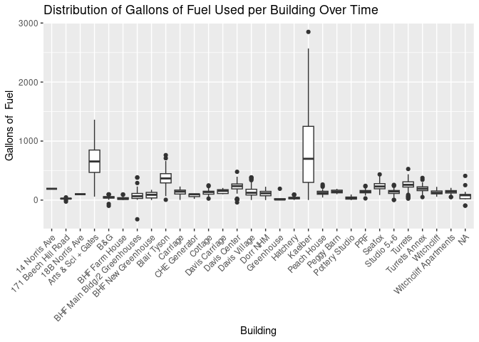
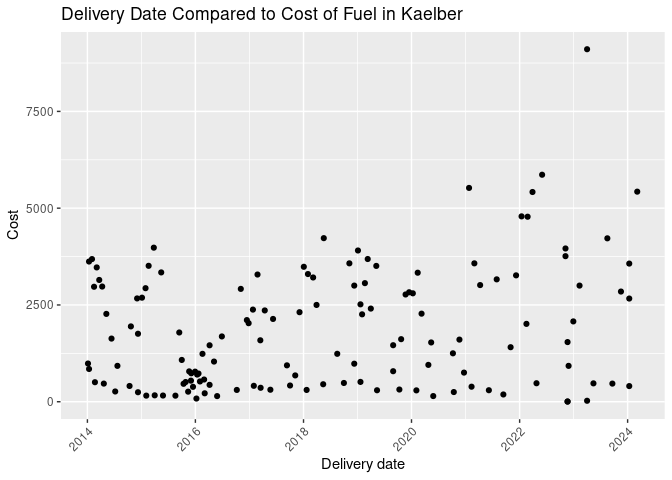
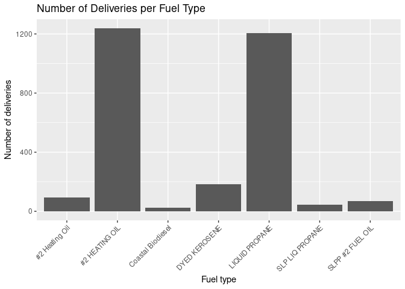
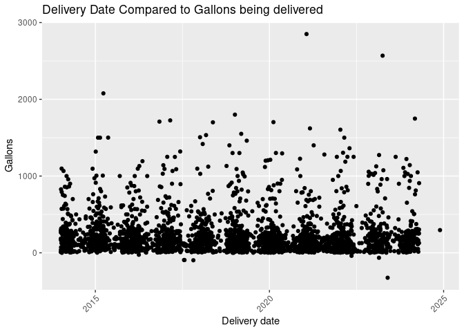

Project proposal
================
Data Betas

``` r
library(tidyverse)
library(broom)
library(readr)
library(lubridate)
```

``` r
fuels <- read_csv("../data/Dead-River.csv",
                  col_names = c("X1", "X2", 
                                "Delivery_date", "Fuel_type",
                                "Tank_number", "Building",
                                "Gallons", "Unit_cost",
                                "Cost")) |>
  select(Delivery_date, Fuel_type, Tank_number, Building, Gallons, Unit_cost, Cost) |>
  filter(Delivery_date != "Delivery Date") |> 
  mutate(Delivery_date = mdy(Delivery_date)) |>
  mutate(Tank_number = case_when(
  Tank_number == "Tank 8" ~ "8",
  Tank_number == "Tank 3" ~ "3",
  Tank_number == "Tank 24" ~ "24",
  Tank_number == "Tank 17" ~ "17",
  TRUE ~ Tank_number
),
Tank_number = as.integer(Tank_number)) %>% 
mutate(Cost = case_when(
    Cost == "610.12 cr" ~ "-610.12",
    TRUE ~ Cost
  ),
  Cost = as.numeric(Cost)) %>% 
  mutate(Gallons = as.numeric(Gallons)) %>% 
  mutate(Unit_cost = as.numeric(Unit_cost))
```

## Introduction

#### Research Question

Which college owned buildings should be prioritized in order to
transition the college off of fossil fuels by 2030?

#### Data

To answer this research question, we will be using data collected by the
COA Community Energy Center on fossil fuel consumption of college owned
buildings. The data set includes delivery dates, fuel types, number of
gallons, unit cost and total cost for fossil fuel deliveries to all
buildings using fossil fuels on campus as well as the two farms. The
data covers all of these deliveries from March 2014 to April 2024. We
are planning on adding data about the square footage of the buildings
and their heating and water heating systems to the data set.

#### Rationale

In 2022, College of the Atlantic’s All College Meeting passed an [energy
policy](https://www.coa.edu/about/environmental-commitment/publications-policies/)
requiring the college to transition off of fossil fuels by 2030. A lot
of work has been done towards this goal, but there is still a
significant amount of work to do. As we get closer to the date, it is
important to have a good understanding of how much fossil fuels we are
still consuming and what areas should be prioritized.

## 2. Data

The data set has 2858 observations, each representing a fossil fuel
delivery to a tank supplying a college owned building. It has 7
variables.

``` r
glimpse(fuels)
```

    ## Rows: 2,858
    ## Columns: 7
    ## $ Delivery_date <date> 2014-01-03, 2014-01-03, 2014-01-04, 2014-01-04, 2014-01…
    ## $ Fuel_type     <chr> "LIQUID PROPANE", "DYED KEROSENE", "#2 HEATING OIL", "#2…
    ## $ Tank_number   <int> 14, 27, 24, 3, 5, 11, 35, 37, 8, 9, 21, 1, 26, 24, 11, 1…
    ## $ Building      <chr> "171 Beech Hill Road", "Witchcliff Apartments", "Dorr NH…
    ## $ Gallons       <dbl> 10.0, 170.0, 185.3, 264.9, 281.4, 299.1, 40.9, 71.6, 827…
    ## $ Unit_cost     <dbl> 1.8481, 3.7304, 3.3417, 3.3417, 3.3417, 3.2998, 1.8481, …
    ## $ Cost          <dbl> 18.48, 634.17, 619.22, 885.22, 940.35, 986.97, 75.59, 13…

## 3. Data analysis plan

#### What variables will you visualize to explore your research questions?

Our analysis will generally focus on comparisons between the buildings.
We plan to look at monthly fossil fuel consumption across the last 10
years by building as well as the cost associated with it. We will also
visualize changes in unit price of the different types of fossil fuels
over the last 10 years. We will have to keep in mind that the data we
have is based on fuel tank deliveries and not on continuous consumption.
Different tanks have different capacities, so we could consider adding
that data to our analysis as well.

#### Will there be any other data that you need to find to help with your research question?

In order to make better sense of our data and explore different methods
for prioritization, we plan to add the square footage of the buildings
and what kinds of heating and water heating systems they use. We might
also add data about when major changes were made to the buildings in
case those account for significant increases or decreases in fossil fuel
consumption. Another set of data we could include are the average
monthly temperatures over the last 10 years.

#### Very preliminary exploratory data analysis, including some summary statistics and visualizations, along with some explanation on how they help you learn more about your data. (You can add to these later as you work on your project.)

#### The data visualization(s) that you believe will be useful in exploring your question(s). (You can update these later as you work on your project.)

``` r
fuels |>
ggplot(aes(x = Building, y = Gallons)) +
  geom_boxplot() +
  labs(x = "Building",
       y = "Gallons of  Fuel",
       title = "Distribution of Gallons of Fuel Used per Building Over Time") +
  scale_x_discrete(guide = guide_axis(angle = 45))
```

<!-- -->

``` r
fuels |>
  filter(Building == "Kaelber") |>
  ggplot(aes(x = Delivery_date, y = Cost)) +
  geom_point() +
  scale_x_date(guide = guide_axis(angle = 45)) +
  labs(x = "Delivery date",
       y = "Cost",
       title = "Delivery Date Compared to Cost of Fuel in Kaelber")
```

<!-- -->

``` r
fuels |>
ggplot(aes(x = Fuel_type)) +
  geom_bar() +
  scale_x_discrete(guide = guide_axis(angle = 45)) +
  labs(x = "Fuel type",
       y = "Number of deliveries",
       title = "Number of Deliveries per Fuel Type")
```

<!-- -->

``` r
ggplot(fuels, aes(x = Delivery_date, y = Gallons)) +
  geom_point() +
  scale_x_date(guide = guide_axis(angle = 45)) +
  labs(x = "Delivery date",
       y = "Gallons",
       title = "Delivery Date Compared to Gallons being delivered")
```

<!-- -->

Data Visualizations that will be useful: - Total Gallons of fuel per
building - Total Gallons of fuel per metre squared of each building -
Total fuel consumption over time and projections

## 4. Data Ethics Review

The data ethics review section will be introduced in a separate class
and is not part of the original proposal deadline.
